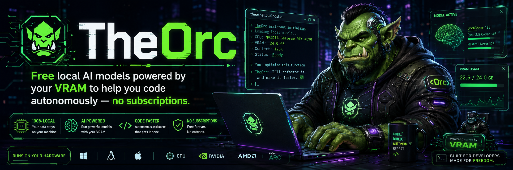
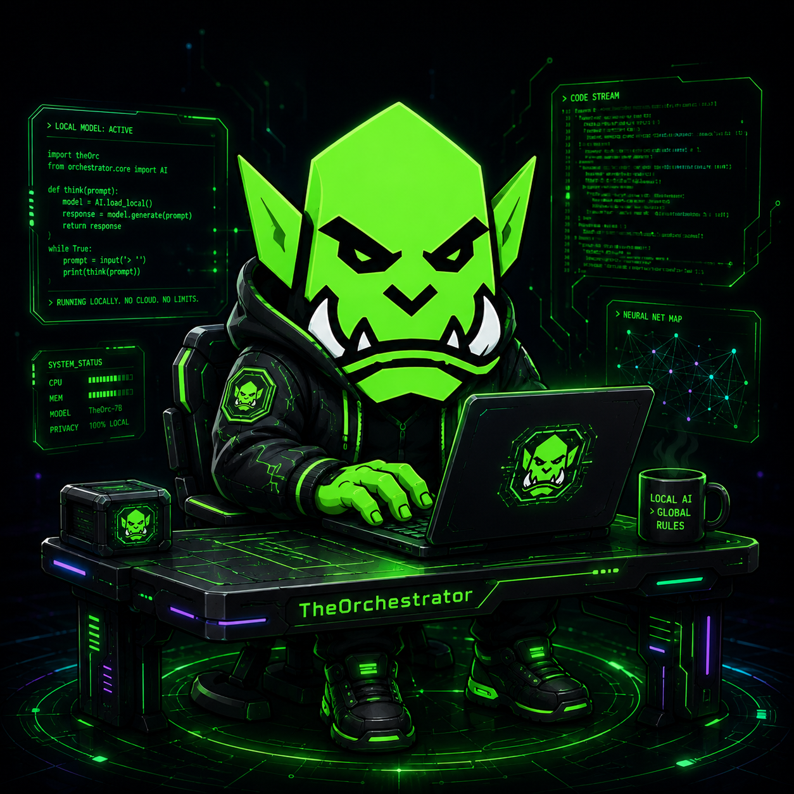
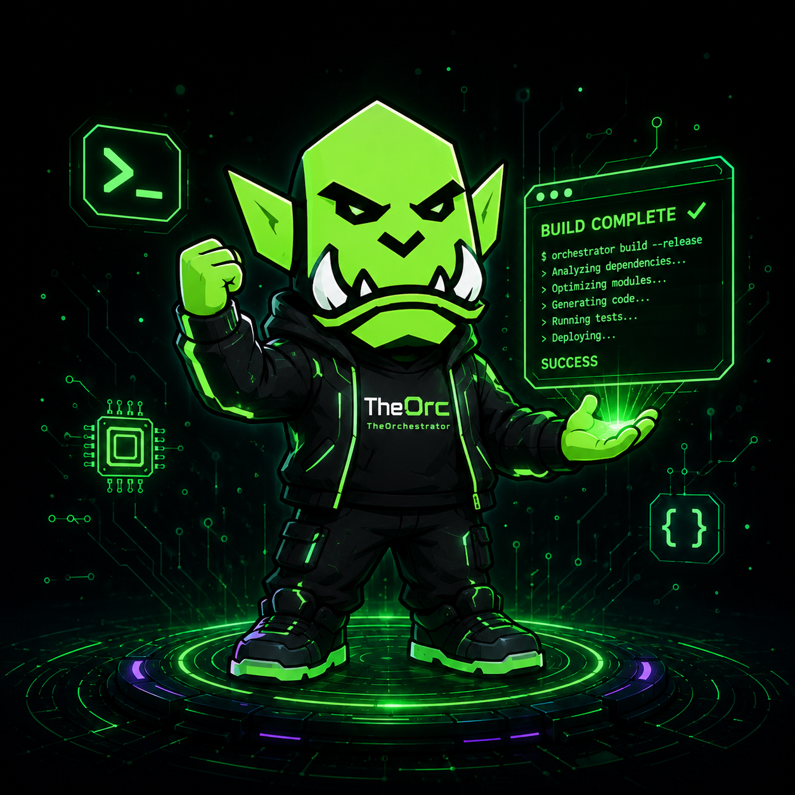

<div align="center">



[](https://github.com/hardcoreerik/TheOrc/releases)
[](https://dotnet.microsoft.com/download/dotnet/10.0)
[](#quick-start)
[](LICENSE)
[](https://github.com/hardcoreerik/TheOrc/releases)

**You already use AI to write code. TheOrc is what happens when you let it run.**

[**Download**](https://github.com/hardcoreerik/TheOrc/releases) · [**Docs**](docs/ARCHITECTURE.md) · [**User Guide**](docs/USER_GUIDE.md) · [**Roadmap**](docs/ROADMAP.md)

</div>

---

## Project Credits

TheOrc is created and maintained by [Erik / hardcoreerik](https://github.com/hardcoreerik), with AI-assisted development and review from Claude Sonnet, OpenAI Codex, and Grok Build.

| Contributor | Role |
|---|---|
| [Erik / hardcoreerik](https://github.com/hardcoreerik) | Creator, maintainer, product direction |
| Claude Sonnet | Architecture planning, implementation support, code review |
| OpenAI Codex | Implementation support, adversarial review, verification |
| Grok Build | Adversarial review, PROJECT_TRUTH audits, runtime critique |

---

## What is this thing?

GitHub Copilot helps you write the next line. Cursor rewrites the current file. ChatGPT gives you code to paste.

TheOrc receives a **goal** — *"build a Python CSV cleaner with a GUI"* — breaks it into parallel tasks, and sends each one to a specialist AI agent. While you wait, a Researcher is reading the pandas docs, two Coders are writing separate files, and a UIDeveloper is setting up the README. When they're done, your workspace has the whole project.

Everything runs on your machine. No API key. No subscription. No code leaves your network.

It's basically a tiny software company that lives in your PC and does what you tell it. The staff are goblins. This is intentional.

---

## Meet the Warband

<div align="center">


</div>

TheOrc is the boss. He reads your goal, writes the plan, and keeps everyone pointed in the right direction. The rest of the swarm handles execution — in parallel, surprisingly fast, and with a work ethic that would shame most interns.

| Role | What they do |
|---|---|
| **TheOrc** | Reads your goal, writes the plan, routes each task to the right goblin |
| **Researcher** | Digs through docs, APIs, and libraries — never touches production code |
| **Coder** | Writes the actual implementation using whatever the Researcher found |
| **UIDeveloper** | Handles all the UI work — XAML, WPF, HTML/CSS, styles |
| **Tester** | Runs tests and reads logs — read-only, no write access, very trustworthy |

The boss model is a **fine-tuned local Gemma 4 12B** (`theorc-boss:gemma4-ft`) — trained by TheOrc's own pipeline on 900 reviewed swarm plans. It scores **99.3%** on structured planning evals. We made the AI smarter by feeding it examples of itself doing a good job. Yes, really.

---

## How it fits your day

<div align="center">



</div>

TheOrc runs **beside your IDE**, not inside it. Keep VS Code, Visual Studio, or whatever you're used to — TheOrc doesn't care. It just needs a folder to work in.

```
1. Point TheOrc at a workspace folder
2. Describe what you want built
3. Watch the swarm plan and execute in real time
4. Review every file and command before it lands — approve, reject, or redirect
5. Commit the result from your normal editor like nothing happened
```

Nothing gets written, no shell command runs, and no git operation executes without going through the approval flow you configure. You're always in the loop. The goblins are enthusiastic but not unsupervised.

---

## vs the tools you're already paying for

| | GitHub Copilot | Cursor | ChatGPT | **TheOrc** |
|---|:---:|:---:|:---:|:---:|
| Runs locally | ❌ | ❌ | ❌ | ✅ |
| Your code stays on your machine | ❌ | ❌ | ❌ | ✅ |
| Multi-agent parallel execution | ❌ | ❌ | ❌ | ✅ |
| Writes files autonomously | ❌ | Partial | Copy-paste | ✅ |
| Monthly cost | $10–19 | $20 | $20 | **$0** |
| Can train its own boss model | ❌ | ❌ | ❌ | ✅ |

TheOrc is not trying to replace your editor. It's the AI **project runner** that sits next to it and does the parts that were never fun to do yourself.

---

## What's new in v1.8

### v1.8.0 — Avalonia markdown renderer + first test suite

The Avalonia cross-platform shell gets its first real renderer and its first test coverage.

**Phase 6 — Native Markdown Renderer (`MarkdownView`)**

Assistant responses in the Avalonia shell now render in rich Markdown — zero new NuGet dependencies. The renderer maps directly to Avalonia's native control tree: headings, bullet and numbered lists, fenced code blocks, blockquotes, inline bold/italic/code/links. It's streaming-safe: an `IsVisible` guard short-circuits rebuilds during token streaming and triggers a single deferred render when the response is complete.

**Phase 7 — First Avalonia test coverage**

| Suite | Tests | What it covers |
|---|---|---|
| `MarkdownViewTests` | 12 | Block/inline parse → control tree; streaming deferred-render guard |
| `PanelConstructionTests` | 10 | Every migrated panel constructs headlessly (AXAML, compiled bindings, resources) |
| `T20 AvaloniaSmokeTests` | 1 | FlaUI: launches the Avalonia exe, asserts the main window appears via UIA |

142 automated tests green across WPF unit, Avalonia headless, and FlaUI smoke.

**Pit Boss hardening** — 10+ rounds: Hermes-3-Llama-3.2-3B default (2 GB, VRAM-safe), two-phase JSON synthesis, shell injection prevention (`ArgumentList` not shell string), cross-platform gen subprocess, concurrent log-write lock, path-traversal guard.

**ORC ACADEMY v2 dataset finalized** — 1,784 train / 200 eval, registered as `train_v2gold`/`eval_v2gold` for Forge. Training run pending.

---

## What's new in v1.7

### v1.7.0 — Avalonia cross-platform UI (Phases 0–5)

v1.7 is the biggest architectural shift since launch: TheOrc now ships **two UIs on one codebase**.

The new Avalonia shell (`net10.0`, no `-windows` suffix) runs on Windows, macOS, and Linux. The WPF shell remains the primary shipping app; Avalonia runs side-by-side against the same Ollama backend, the same HIVE mesh, and the same workspace.

| Phase | What landed |
|---|---|
| **Phase 0** | Blank Avalonia 12 shell — AppBuilder, dark theme, brand colours |
| **Phase 1** | Service layer decoupled — `OllamaClient`, `SwarmOrchestrator`, `HiveService` etc. extracted to shared project; both UIs wire against the same interfaces |
| **Phase 2** | Code editor + tool editor ported to `AvaloniaEdit` |
| **Phase 3A** | Simple panels: File Explorer, Settings, Checkpoint Browser, Session Browser |
| **Phase 3B** | Agent panel, Chat panel, Update panel, Warm-up editor |
| **Phase 3C** | HIVE panel, Pit Boss panel, Swarm Board, Training Pit — full dark-theme DataTemplates |
| **Phase 4** | DiffViewer, ShellApprovalCard, UnknownToolCard — approval flow wired end-to-end |
| **Phase 5** | Full IDE layout in `MainWindow.axaml` — ribbon nav, pill switcher, panel host, status bar |

121/121 unit tests green. Grok review: CLEAN.

---

## What's new in v1.6

### v1.6.1 — HIVE security audit & hardening

A full adversarial review of the HIVE cryptographic layer — independent passes via Codex, Cerebras, and a local multi-angle review — with every confirmed finding fixed and covered by tests.

| Fix | What changed |
|---|---|
| **Election forgery** | Election messages (suspect / claim / recover / stepdown) now verify the sender's ECDSA signature. Previously the signature was generated but never checked, letting any LAN peer forge an election and seize the Warchief crown |
| **Fail-closed auth** | `GracePeriodActive` defaults to false; every authenticated endpoint rejects unsigned requests — no anonymous fall-through |
| **Canonical injection** | Request paths are sanitised before HMAC signing, closing a newline field-boundary forgery |
| **Replay after restart** | The nonce replay cache is persisted and restored across restarts (zero replay window on graceful restart, ~5s on hard kill), and recorded only after HMAC verification so it can't be flooded |
| **Revocation race** | Trust check and shared-secret lookup are now a single atomic operation (TOCTOU closed) |
| **Liveness integrity** | Heartbeats are never sent unsigned; a peer that rejects our credentials (401/403) is treated as offline, not healthy |
| **Task-queue races** | Claim / heartbeat / complete / fail and the timeout watchdog are serialised, closing a data race on task ownership |
| **Licensing** | AGPL-3.0 + commercial dual license, a SECURITY.md disclosure policy, and SPDX headers across the source tree |

51/51 HIVE security tests green, including new coverage that rejects forged election messages.

---

Security-hardened HIVE MIND, Update Center with fleet deploy, and a solid headless test foundation.

| Feature | What it is |
|---|---|
| **HIVE security overhaul** | Full cryptographic identity layer: P-256 ECDSA signing, ECDH key exchange, HMAC-SHA256 per-request auth, nonce replay cache, Bully election, DPAPI secret storage — replaces the honor-system prototype |
| **Port 7079 HMAC enforcement** | Task queue endpoints are now fail-closed; workers sign every request; unsigned = 401 |
| **Warchief crown badge** | Gold border and `👑` marker on the correct constellation node card, resolved live via peer store |
| **Update Center** | New `⬆ Update` tab: version card, inline build log, downloads pre-built exe from GitHub releases (falls back to build-from-source), gold dot on mode button when update available |
| **Fleet deploy** | Warchief can push an update to all outdated worker nodes from the Update Center — each node updates and restarts autonomously |
| **Headless unit tests** | `OrchestratorIDE.UnitTests` project: 112 pure-logic tests pass in ~1 s over SSH with no display required |

---

## What's new in v1.5

The biggest release since the swarm itself. v1.5 closes the training loop — from a human describing what they want the swarm to learn, all the way to a deployed adapter, without touching a script.

| Feature | What it is |
|---|---|
| **Pit Boss** | AI training wizard — 8 questions, then TheOrc writes its own training plan and kicks off dataset generation |
| **SQLite metadata layer** | Every capture, plan, run, and dataset now has a queryable database behind it — shipped a full release early |
| **Plan history** | Pit Boss landing page showing every training run with status, target count, model, and timestamp |
| **Worktree isolation** | Each swarm task gets its own git worktree — parallel runs are conflict-free by construction |
| **Reviewer Quality Gate** | Swarm output isn't authoritative until a Reviewer passes it, formalized at the merge step |
| **ORC ACADEMY v1** | Fine-tuned boss adapter trained, evaluated, and deployed — `theorc-boss:gemma4-ft` is live |

---

## ORC ACADEMY — the swarm teaches itself

Here's the part that gets genuinely weird in the best way.

Every good swarm run captures the boss's plan. Those captures go through a review pipeline. When you have enough reviewed examples, **ORC ACADEMY** trains a LoRA adapter on your own GPU. The new boss model is better at planning the next run. Which produces better captures. Which trains a better adapter. You get the idea.

**v1 shipped — June 2026 ✅**
- 900 reviewed boss plans, harvested overnight by GOBLIN HARVEST while the PC sat idle
- LoRA trained locally in **148 minutes** on an RTX 5070 Ti
- Result: **99.3% structured planning pass rate**, up from 94.5% on the base model
- Shipped as `theorc-boss:gemma4-ft` — a 125 MB GGUF LoRA you can pull right now

**v2 post-mortem ❌**
- Trained on 1,784 examples from Pit Boss + Cerebras generation
- Suitability audit later found 51.3% of examples had write tasks assigned to TESTER-lane roles — teaching the boss exactly the wrong behavior
- A/B result: structured-plan pass rate dropped from 99.3% (v1) to 77.8%, perfect plans 71% → 54%
- v1 remains the active production adapter; v2 was retired and the data repurposed

**v3 in progress — June 2026 🔄**
- Root cause fixed: suitability gate (pre-training contamination check) now blocks tester-poison examples before VRAM is allocated
- Clean dataset: 906 train / 87 eval (zero tester-poison, zero leakage)
- Training on RTX 5070 Ti, rubric-in-the-loop checkpoint selection
- v1 baseline holds until v3 passes A/B eval at ≥ 99%

The loop — *run → capture → review → gate → train → deploy* — is part of the product. TheOrc is designed to get better the more you use it, entirely on your own hardware, with no data leaving your machine.

---

## PIT BOSS — the training wizard

ORC ACADEMY is powerful. Pit Boss makes it self-serve.

Tell Pit Boss what you want the swarm to get better at. It runs a short interview — eight questions about goal types, languages, edge cases, example count — and turns your answers into a structured training plan. Then it kicks off dataset generation (via Cerebras cloud or local Ollama) and hands the finished dataset off to ORC ACADEMY's Forge for LoRA training on your GPU.

You go from "I want a smarter boss" to a queued training run without writing a script or touching the command line.

This is the exact pipeline that generated the v2 dataset:
```
1. Pit Boss interview (in-app) → structured training plan
2. Dataset gen via Cerebras gpt-oss-120b — ~1,200 examples, ~20 min, free tier, zero API cost
3. Pit Boss hands off to Forge → train_lora.py on your GPU
4. New adapter registered in Ollama, ready to pull
```

The full loop — from "I want better planning" to a deployed adapter — is now in the app UI.

---

## Quick Start

### One-click installer

1. Grab `OrchestratorSetup.exe` from [Releases](https://github.com/hardcoreerik/TheOrc/releases)
2. The installer detects your GPU and walks through Ollama setup — it's pretty painless
3. Launch TheOrc, open a workspace folder, describe something you want built

### Build from source

```powershell
git clone https://github.com/hardcoreerik/TheOrc.git
cd TheOrc
dotnet run --project OrchestratorIDE/OrchestratorIDE.csproj
```

**Requirements:** Windows 10/11 · .NET 10 · [Ollama](https://ollama.com) · 8 GB VRAM minimum (16 GB recommended for running a full swarm)

### Grab a model and go

```powershell
# Recommended starting stack
ollama pull theorc-boss:gemma4-ft   # fine-tuned boss — 125 MB LoRA over Gemma 4 12B QAT
ollama pull qwen2.5-coder:14b       # coder workers — great speed/quality balance
```

> **No dedicated GPU?** TheOrc works with CPU-only Ollama, just slower. 7B coder models run fine at CPU speeds for most tasks. Give it a shot.

---

## Documentation

| | |
|---|---|
| [ARCHITECTURE.md](docs/ARCHITECTURE.md) | How the shell, swarm, GOBLIN MIND, and Training Pit all connect |
| [USER_GUIDE.md](docs/USER_GUIDE.md) | Best place to start on day one — modes, approvals, workspaces |
| [SWARM_GUIDE.md](docs/SWARM_GUIDE.md) | How goals become plans and how to steer the swarm mid-run |
| [TRAINING_PIT_GUIDE.md](docs/TRAINING_PIT_GUIDE.md) | Capture → review → ORC ACADEMY training, step by step |
| [GLOSSARY.md](docs/GLOSSARY.md) | Every TheOrc term in one place — goblins, captures, manifests, all of it |
| [ROADMAP.md](docs/ROADMAP.md) | What's shipped, what's cooking, what's next |

---

<div align="center">



</div>

---

## License

TheOrc is licensed under the **GNU Affero General Public License v3.0 (AGPL-3.0)** — see [LICENSE](LICENSE).

In plain terms: you are free to use, study, modify, and share TheOrc. If you run a **modified** version as a network service, AGPL requires you to make your changes available to the people using it. Running it locally for yourself or your team imposes no such obligation.

**Need different terms?** If AGPL doesn't fit your situation — for example, you want to build a closed-source product on top of TheOrc, or embed it in a commercial offering without the copyleft obligations — a **commercial license** is available. See [LICENSING.md](LICENSING.md).

Contributions are welcome under the [Contributor License Agreement](CLA.md), which keeps the dual-license model possible.

---

## Support the project + what's coming

TheOrc is free, open source, and always will be. If it saves you a subscription or two, consider throwing something in the jar:

<div align="center">

[](https://ko-fi.com/hardcoreerik)
[](https://paypal.me/hardcoreerik)
[](https://github.com/sponsors/hardcoreerik)

</div>

Here's what's on the workbench — this is where support goes:

### 🧠 ORC ACADEMY v2 — smarter boss, broader goals
The v1 adapter was trained on 900 plans, almost all C# feature work. v2 fixes that: the Pit Boss pipeline is already generating ~1,200 synthetic examples covering bugfixes, refactors, tests, integrations, and docs across a dozen languages — using Cerebras cloud inference at no cost. Once reviewed, v2 trains a boss that handles real-world requests, not just TheOrc building itself.

### 🌐 HIVE MIND — distributed swarm across your whole network
HIVE MIND lets multiple TheOrc machines coordinate over your local network. One machine runs the boss and hands off worker tasks to others. Your gaming rig does the planning, your NAS runs a coder, the old workstation in the corner finally earns its keep. Phase A is shipped (LAN discovery, queue, worker polling). Phase B is full distributed task execution and remote harvest.

### 🎓 On-platform self-improvement
The long game: TheOrc writes its own training goals, runs them through the swarm, and feeds the results back into ORC ACADEMY — closing the loop with minimal human input. The Pit Boss pipeline makes the dataset generation side of this almost free. The remaining work is getting the swarm to generate and judge its own goals.

### 💻 Cross-platform
TheOrc is Windows-first (WPF/.NET). A Mac and Linux path is on the roadmap once the core stabilizes. Ollama already runs everywhere — the UI is the hold-out.

---

### 🖥️ We want your hardware

Seriously. HIVE MIND needs real multi-machine testing and TheOrc needs to prove it runs well on hardware beyond the dev rig. If you have any of the following gathering dust, get in touch — you'd be doing the warband a real favour:

| Hardware | What we'd test |
|---|---|
| **Multi-GPU Windows rig** | Distributed swarm with workers on separate GPUs |
| **AMD GPU (RX 7000 / RX 9000)** | ROCm + Ollama compatibility, full swarm on AMD |
| **High VRAM card (24 GB+)** | Larger model support, bigger context, faster worker throughput |
| **Low-spec machine (4–8 GB VRAM / CPU-only)** | Minimum viable swarm, small model combinations |
| **Second Windows machine (any spec)** | HIVE MIND Phase B — multi-node job routing |
| **Mac (Apple Silicon)** | Groundwork for the cross-platform path |

Drop a note in [Issues](https://github.com/hardcoreerik/TheOrc/issues) with the tag `test-lab` or reach out directly. Hardware contributors are credited in [docs/SPONSOR_TEST_LAB.md](docs/SPONSOR_TEST_LAB.md).

The goblins are grateful. They work for free but they do appreciate the compute.
