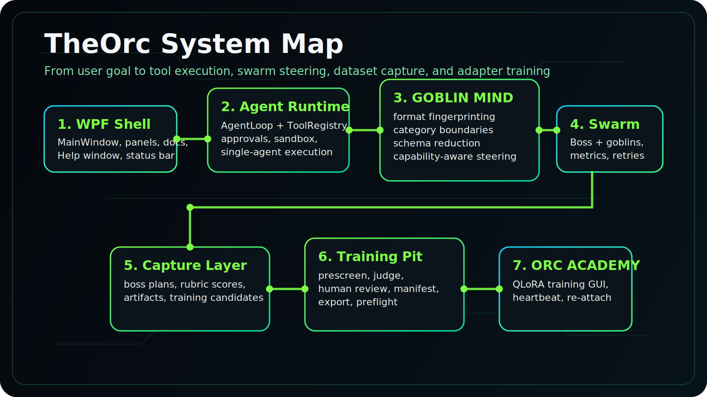
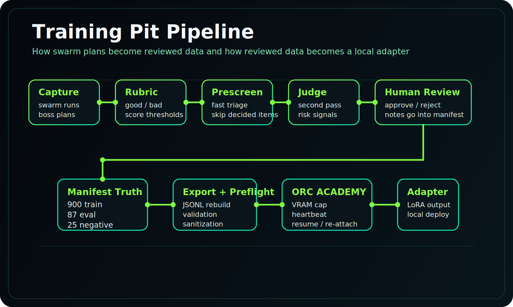
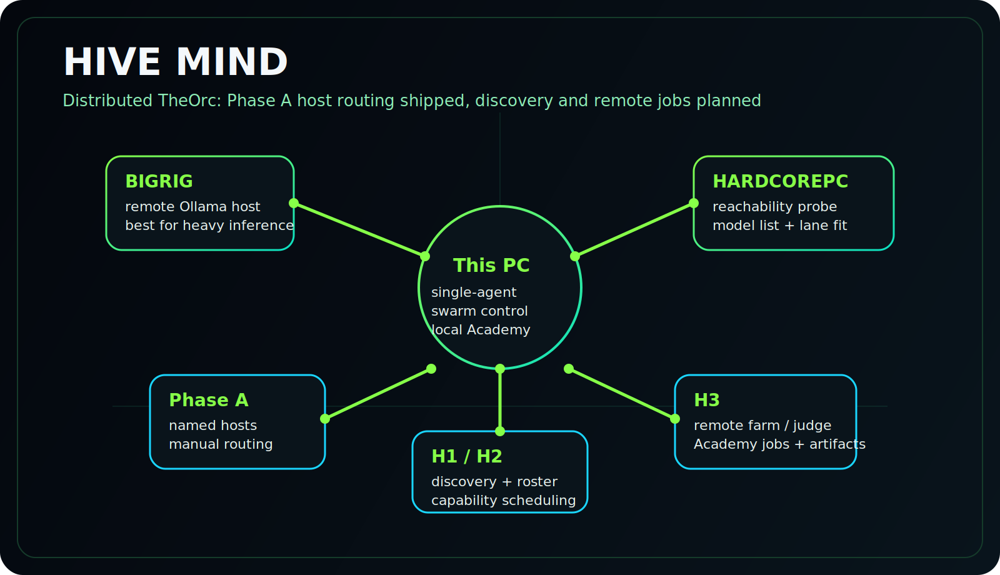

<div align="center">


<br/>

[](https://github.com/hardcoreerik/TheOrc/releases)
[](https://dotnet.microsoft.com/download/dotnet/10.0)
[](#what-theorc-is)
[](#what-shipped-since-v120)
[](#training-pit--orc-academy)
[](#documentation)

<br/>

[**Download Setup**](https://github.com/hardcoreerik/The-Orchestrator/releases) · [**Architecture**](docs/ARCHITECTURE.md) · [**User Guide**](docs/USER_GUIDE.md) · [**Training Pit**](docs/TRAINING_PIT_GUIDE.md) · [**Roadmap**](docs/ROADMAP.md)

</div>

## What TheOrc Is

**TheOrc is a Windows-native, 100% local AI coding assistant** that pairs a WPF shell with a guarded agent runtime, a multi-lane goblin swarm, evidence-driven model steering, and a built-in training pipeline. It is designed for people who want the convenience of an AI coding product without handing their repo, prompts, or workflow to a cloud subscription.

The product story is simple: give TheOrc a workspace and a goal, let it plan before it acts, approve the diffs and commands you care about, and keep the whole loop on your own hardware. When swarm runs produce good plans, the Training Pit turns those reviewed captures into dataset rows, and ORC ACADEMY turns that dataset into a local adapter.



## Why It Feels Different

| TheOrc | What it means in practice |
|---|---|
| 100% local by design | Your prompts, code, captures, and adapters stay on your machine unless you explicitly move them. |
| Plan first, then act | The agent proposes a plan before execution, and write or shell operations stay approval-aware. |
| Goblin swarm orchestration | Boss, coder, UI developer, researcher, and tester lanes can work as a coordinated system instead of one giant chat loop. |
| GOBLIN MIND steering | Tool-call format, category boundaries, schema reduction, and steering decisions are driven by observed model behavior instead of blind optimism. |
| Training loop included | Good swarm plans do not just disappear into logs; they can become reviewed data and then a LoRA adapter. |
| Docs in the product | `F1` opens the embedded Help window, and the guides cross-link inside the app. |

## What Shipped Since v1.2.0

The `v1.2.3` landing page was the right base, but the codebase has moved meaningfully since then. The current `master` branch now includes:

### Swarm and GOBLIN MIND Upgrades

- In-app Help on `F1`, powered by the embedded Markdown viewer and guide routing
- Status-bar build stamp so operators can see the exact build and commit they are running
- Live GOBLIN MIND capability badges under Swarm Board model pickers
- The Evolution tab for schema fitness data in the tool-probe surface
- Steering tests and extracted `SwarmSteering` logic for capability-aware routing
- Token-cost estimation on the context badge for the next request, not just current context use

### Model Intelligence Surfaces

- Model comparison view
- Historical trends strip in the Model Wiki detail pane
- Markdown export of the capability matrix
- `Probe Now` in both the Model Wiki detail flow and Swarm Board surfaces
- Category filter chips and stale-probe refresh work for capability results

### Training Pit and Data Pipeline Growth

- Training Pit panel with live activity cues
- ORC ACADEMY rebrand in the app UI
- VRAM cap support for training
- Heartbeat-driven progress and hang detection
- Resume and re-attach after app restart
- GOBLIN HARVEST and NIGHT HARVEST farming workflows
- Marker watcher support to stop NIGHT HARVEST around the target data threshold
- Current preflight-ready dataset counts: **900 train / 87 eval / 25 negative**

### Docs and Operator Tooling

- Architecture and glossary guides added to the docs suite
- Embedded Help window wired into the app
- `Tools/codex-review.ps1` for scripted Codex review output
- HIVE MIND product spec plus Phase A host-store groundwork in code

## Product Surfaces Today

| Area | Current state |
|---|---|
| WPF shell, editor, file explorer, command palette | Implemented |
| Single-agent plan/execute loop | Implemented |
| Approval-aware writes and shell calls | Implemented |
| Goblin swarm with boss + worker roles | Implemented |
| Capability-aware steering and probe badges | Implemented |
| Model Wiki, compare view, trends, export, probe-now | Implemented |
| Embedded Help window and in-app docs routing | Implemented |
| Build stamp and token-cost estimator | Implemented |
| Training Pit review/export/preflight flow | Implemented |
| ORC ACADEMY GUI with VRAM cap, heartbeat, resume, re-attach | Implemented |
| HIVE MIND named host store + reachability probe foundation | Implemented |
| Full HIVE discovery, roster, and remote job fabric | Planned / active spec work |

## Goblin Swarm


TheOrc can work in a single-agent loop, but its signature mode is the **Goblin Swarm**:

| Role | Responsibility |
|---|---|
| **TheOrc (Boss)** | Breaks down the goal, routes work, retries weak outputs, and synthesizes the final outcome. |
| **Coder Goblin** | Writes and edits code, creates files, and handles implementation-heavy work. |
| **UIDeveloper Goblin** | Focuses on WPF, XAML, styles, and user-facing presentation layers. |
| **Researcher Goblin** | Reads docs, investigates APIs, and supplies evidence without writing production files. |
| **Tester Goblin** | Runs tests and inspects logs without `write_file` access, then reports verdicts back to the boss. |

Swarm execution is not just parallelism for its own sake. `SwarmSteering` uses category maps from GOBLIN MIND to decide whether a model is fit for a role, and the boss prompt gets a capability summary instead of pretending every model is equally trustworthy.

## Training Pit & ORC ACADEMY

TheOrc is not only an app shell. It includes the beginnings of its own improvement loop.



The end-to-end flow is:

1. Swarm runs capture boss plans and score them.
2. Prescreen and judge scripts triage the queue.
3. Human review writes the final decision into the manifest.
4. JSONL exports are rebuilt from approved manifest entries.
5. `phase3_preflight.py` verifies counts, validation, sanitization, duplicates, eval isolation, and staging safety.
6. ORC ACADEMY launches `training_pit/scripts/train_lora.py` for local QLoRA fine-tuning.

Today, the dataset is not hypothetical. Preflight currently reports:

- `900` approved train examples
- `87` approved eval examples
- `25` approved negative examples

The ORC ACADEMY panel is operator-oriented rather than toy-grade. It exposes a VRAM cap, watches a training heartbeat, treats stale heartbeat or log activity as a possible hang, and can re-attach to a surviving Python trainer after an app restart.

## HIVE MIND

HIVE MIND is the distributed layer for TheOrc: the idea that your local shell can see more than one machine and route work to the hardware that actually fits it.



The important distinction is:

- **Already in code:** Phase A host groundwork, including named remote Ollama hosts and reachability probes
- **Specified and prioritized:** automatic discovery, roster UI, capability-aware node scheduling, remote farm/judge/Academy jobs, artifact return, and Scout-lane small-boss training

The full spec lives in [docs/HIVE_MIND_SPEC.md](docs/HIVE_MIND_SPEC.md), but the short version is that HIVE MIND is not a vague future idea anymore. It already has a concrete product contract and a first code foothold in `Services/Hive/HiveHosts.cs`.

## Quick Start

### Option 1: One-click installer

1. Download `OrchestratorSetup.exe` from [Releases](https://github.com/hardcoreerik/The-Orchestrator/releases).
2. Let the installer detect your GPU, VRAM, and backend path.
3. Pick a coding profile and model fit.
4. Launch TheOrc and open a workspace.
5. Press `F1` once to confirm the in-app Help system is wired and the docs viewer renders correctly.

### Option 2: Build from source

```powershell
git clone https://github.com/hardcoreerik/The-Orchestrator.git
cd The-Orchestrator
dotnet run --project OrchestratorIDE/OrchestratorIDE.csproj
```

### First run checklist

- Start an inference backend such as Ollama first
- Run a small task in `Single` mode before moving to `Swarm`
- Check the status bar for the active model and build stamp
- Open the Model Wiki / Lab if you want to compare or probe candidate models
- Open the Training Pit if you are reviewing captures or running ORC ACADEMY

## Documentation

The docs suite is now broad enough that new users should start in the docs index, not by guessing.

| Start here | Why |
|---|---|
| [docs/ARCHITECTURE.md](docs/ARCHITECTURE.md) | White-paper overview of the shell, runtime, GOBLIN MIND, swarm lifecycle, Training Pit, and planned HIVE MIND layer. |
| [docs/GLOSSARY.md](docs/GLOSSARY.md) | Defines TheOrc vocabulary once: goblins, ORC ACADEMY, GOBLIN HARVEST, captures, manifests, Scout lane, and more. |
| [docs/USER_GUIDE.md](docs/USER_GUIDE.md) | Best day-one operator guide. |
| [docs/SWARM_GUIDE.md](docs/SWARM_GUIDE.md) | How goals become swarm work. |
| [docs/TRAINING_PIT_GUIDE.md](docs/TRAINING_PIT_GUIDE.md) | How swarm work becomes reviewed data and then an adapter. |
| [docs/ROADMAP.md](docs/ROADMAP.md) | Repo-verified shipped work, active work, and planned work. |

You can also open [docs/README.md](docs/README.md) for the full guide index.

## Hardware and Model Fit

TheOrc still targets real local hardware constraints instead of pretending every box is a datacenter:

| Hardware tier | What it is good at |
|---|---|
| CPU / tiny VRAM | Small coder or researcher models, single-agent use, docs, probes |
| 8 GB class GPU | Practical local boss + worker setups, light swarm usage |
| 12–16 GB class GPU | Better coding models, richer swarm configurations, stronger Model Wiki testing |
| 16+ GB class GPU | ORC ACADEMY training, heavier local inference, better multi-role fit |

That same realism now shapes the HIVE MIND design: nodes advertise what they can actually do, and future remote scheduling is supposed to disable invalid targets instead of letting users discover VRAM failure at the end of a run.

## Roadmap Snapshot

### Now

- Harden the current local-first loop: swarm quality, model steering, probes, docs, and operator surfaces
- Keep growing the reviewed Training Pit corpus while ORC ACADEMY remains usable on day-to-day hardware
- Build on the HIVE Phase A groundwork already in `master`

### Next

- HIVE MIND H1: discovery, roster, pairing
- HIVE MIND H2: node-aware lane scheduling and capability gating
- HIVE MIND H3: remote farm, judge, ORC ACADEMY jobs, and artifact return
- Scout-lane training for smaller boss-class adapters

### Later

- Cross-platform backend and UI path via Docker + Blazor
- Background-agent quality-of-life work
- More generated capability summaries and model intelligence surfaces

For the detailed milestone view, read [docs/ROADMAP.md](docs/ROADMAP.md).

## Support TheOrc

TheOrc is free, open source, and unapologetically local-first. If it saves you a subscription bill, consider supporting the project:

- [Ko-fi](https://ko-fi.com/hardcoreerik)
- [PayPal](https://paypal.me/hardcoreerik)
- [GitHub Sponsors](https://github.com/sponsors/hardcoreerik)

Hardware vendors and test-lab contributors should also see [docs/SPONSOR_TEST_LAB.md](docs/SPONSOR_TEST_LAB.md).

